# Satellite Embeddings

A series of experiments exploring Google DeepMind's AlphaEarth satellite embedding dataset to understand patterns of environmental change through multi-dimensional embedding space.

## Live Projects

- **[Embedding Distance Grid Interface](https://elliemadsen.github.io/satellite-embeddings/distance_experiment_web/index.html)** – Interactive web application for exploring globally sampled satellite embeddings as grids in 1D, 2D, and 3D. Change number of samples, reduce dimensions with UMAP or t-SNE algorithm, view satellite image or false color.
- **[Embedding Topography Interactive Visualization](https://elliemadsen.github.io/satellite-embeddings/dimension-reduction/point_cloud.html)** – Interactive web application for exploring latent space. Globally sampled embeddings reduced to 3d with UMAP or t-SNE.
- **[False Color Embedding Globe](https://elliemadsen.github.io/satellite-embeddings/web-maps/globe.html)** – Interactive 3D globe visualization of satellite embeddings
- **[Earth Engine App](https://gsapp-map.projects.earthengine.app/view/sat-embeddings)** – Interactive web app for real-time analysis

---

## Project Structure

### **dimension-reduction/** – Global Sampling & UMAP Projection

Generates a global dataset of classified satellite embeddings and reduces them to 3d, 2d, and 1d using tsne and umap.

- Labels global sampling by land classification using Copernicus land cover and geographical region
- Samples 1000–5000 locations globally, extract embedding vectors
- Applies UMAP or t-SNE dimensionality reduction to project embeddings to 3d, 2d, and 1d
- Writes the data to geojson in data/
- html + js read the data and produce interactive data viz using three.js showing animation from world to embedding space.

**Inputs:** Google Satellite Embedding V1 (2024), Copernicus Global Land Cover, UN shapefile  
**Outputs:** GeoJSON files with embeddings coords, HTML point cloud visualization

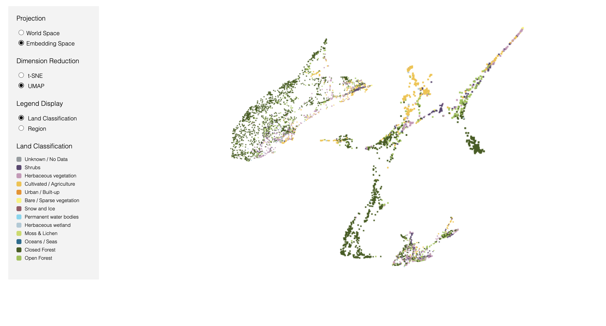

---

### **distance_experiment/** – Temporal & Spatial Embedding Distance

Compares embedding spaces across years and generates large-scale similarity grids.

- **global-similarity-grid.ipynb**: Extends to global scale using pre-computed UMAP coordinates from dimension-reduction
- **us-similarity-grid.ipynb**: Creates US-wide grid of sample points, extracts embeddings for multiple years (2021–2024), computes Euclidean distances between year pairs
- **gen-us-samples.ipynb**: Generates random coordinate samples for the US grid
- Outputs satellite patches and metadata for each location

**Inputs:** Random or stratified coordinates, Google Satellite Embeddings (multi-year)  
**Outputs:** csv/json, satellite patch image files, static grid images

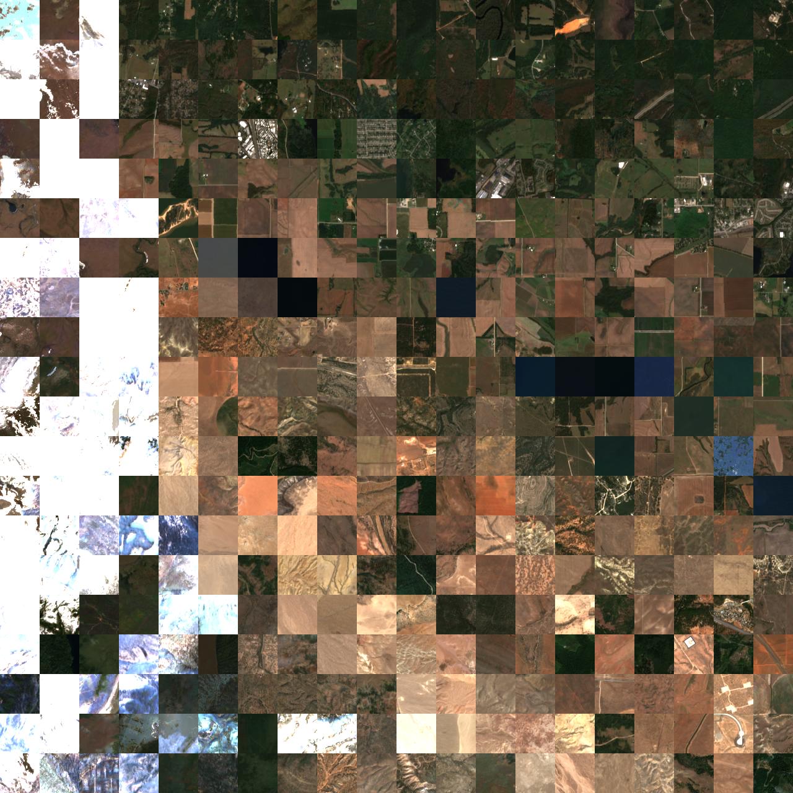

---

### **distance_experiment_web/** – Interactive Dimensionality Reduction Visualization

Interactive web application for exploring dimensionality-reduced satellite embeddings in 1D, 2D, and 3D with live false color band selection.

- **generate_web_data.ipynb**: Preprocesses data from dimension-reduction experiments
  - Uses Hungarian algorithm to arrange embeddings optimally in 1D, 2D and 3D grid layouts
  - Downloads 62 false color band combinations per location (consecutive triplets: A00-A01-A02 through A61-A62-A63) and true color RGB satellite imagery
  - Exports data tiles (`tiles/{index:04d}/{index}_A{b1}_A{b2}_A{b3}.png`) and geojson files with grid coordinates
- **Interactive Visualization** (index.html, styles.css, app.js):
  - Toggle between 1D / 2D / 3D arrangements, UMAP / t-SNE, true color satellite imagery / false color embedding bands
  - Band selector: Vertical interactive slider to select 3 consecutive bands from 64 available (A00-A63) with live RGB updates
  - Modal image viewer, hover popup metadata interaction, n samples slider, etc

**Inputs:** Classified embeddings from dimension-reduction/ , Google Satellite Embeddings, Sentinel-2/Landsat-8 imagery  
**Outputs:** Tile directories with 62 band combinations + RGB per location, geojson, interactive HTML visualization

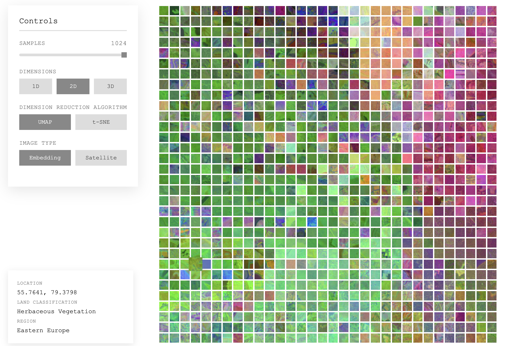

---

### **distance-correlation/** – Geographic vs Embedding Distance Analysis

Investigates the relationship between geographic proximity and embedding similarity to identify anomalous location pairs.

- **distance-similarity-correlation.ipynb**: Comprehensive analysis of geographic distance vs embedding similarity patterns
  - Samples 1000 locations from 5000 classified embeddings, computes pairwise distances and similarities for 5000 random pairs
  - Identifies Far but Similar and Near but Different outlier pairs
  - Creates scatter plots showing the negative correlation between distance and similarity

**Inputs:** 5000 classified embeddings from dimension-reduction/...
**Outputs:** PNG visualizations (scatter/heatmap with/without anomalies), embedding dimension comparison plots, detailed statistical analysis of anomalous pairs

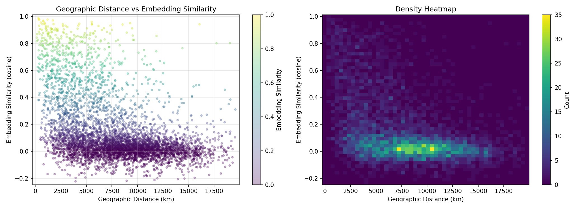

---

### **web-maps/** – Global Web Visualization

Generates web tiles and interactive globe for global embedding exploration.

- **gen-tiles.ipynb**: Exports global embedding data as GeoTIFFs (4 regional exports) from Earth Engine to Google Drive, then locally:
  - Merges 4 GeoTIFFs into single global dataset
  - Converts from 32-bit to 8-bit and EPSG:4326 → EPSG:3857
  - Generates tile pyramid (zoom 0–8) in XYZ tile structure
- Creates interactive globe.html with Three.js or Cesium viewer

**Inputs:** Google Satellite Embedding V1 (2024), global geometry  
**Outputs:** Tile pyramid (xyz structure for zoom 0–8), globe HTML viewer

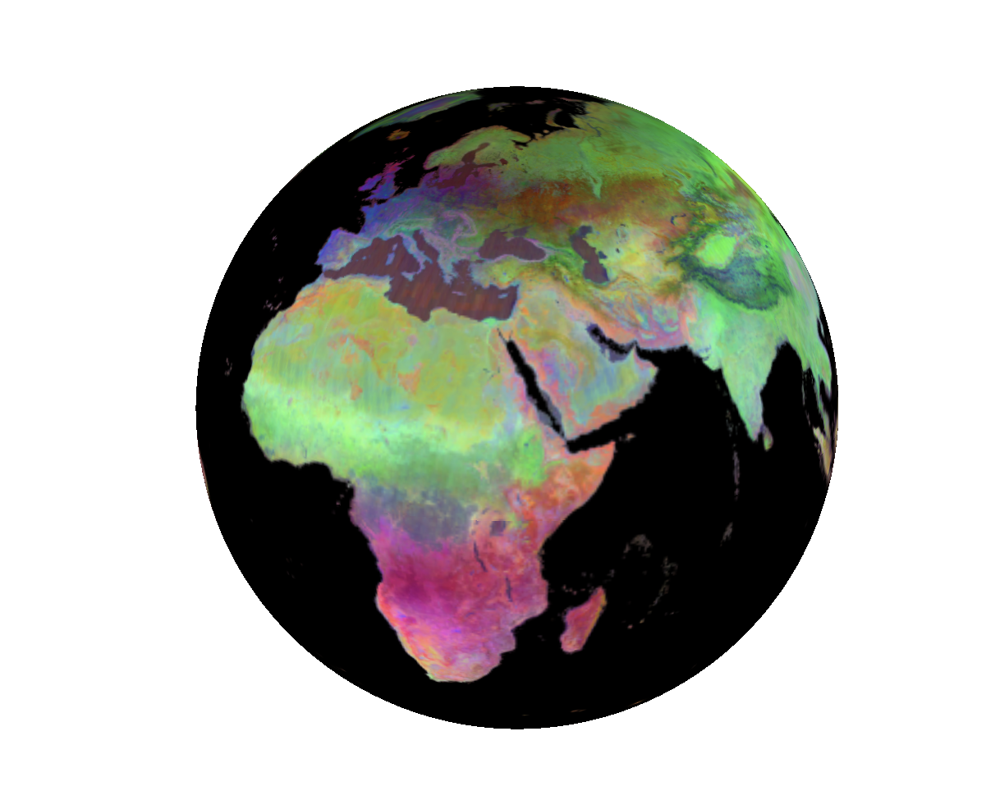

---

### **two-point-projection/** – Two-Point Equidistant Projection

Creates a cartographic projection centered on two geographic points using D3.js.

- Implements d3.js `geoTwoPointEquidistant` projection with two anchor points from near locations in embedding space (Alaska and Greenland)
- Interactive HTML/SVG visualization

**Inputs:** `land-50m.json` (TopoJSON land geometry)  
**Outputs:** Interactive HTML map with two-point equidistant projection, downloadable SVG

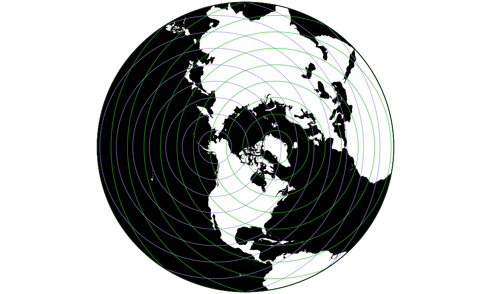

---

### **poster/** – Drawing Generation

Generates visualizations for poster/publication materials. Also includes Adobe Illustrator poster file.

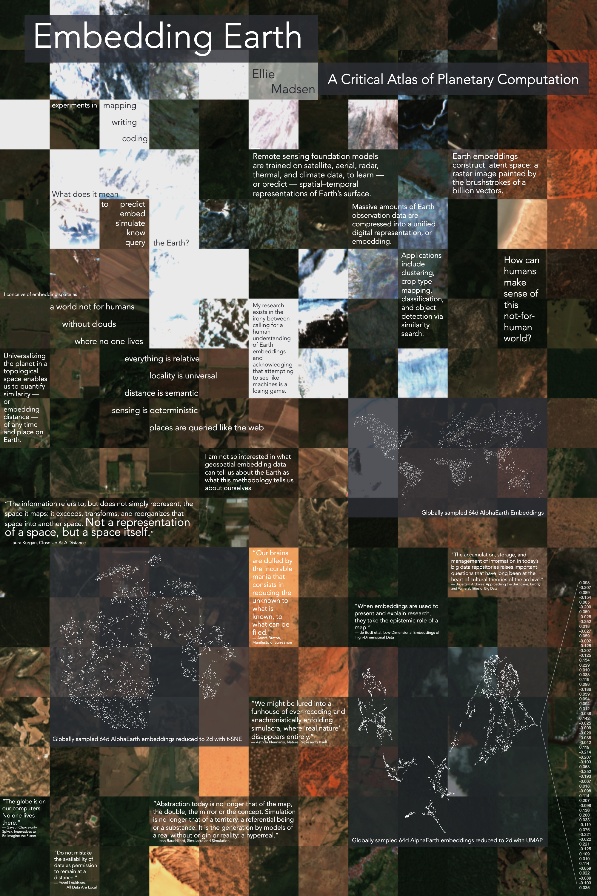

---

### **element-embeddings/** – Element Analysis

Creates drawing comparing four elemental typologies: forest, water, ice, desert.

**Inputs:** Element GeoJSON with locations  
**Outputs:** Embedding vectors per element, satellite/drawing comparisons

---

### **watershed/** – Temporal Embedding Change Analysis - NYC Watershed, Catskills

Analyzes satellite embedding changes in NYC watershed between 2017 and 2024.

- Filters embeddings to 50km watershed region
- Compares 2017 vs 2024 embeddings via K-means clustering (6, 10, 20 clusters)
- Computes per-pixel Euclidean distance between years
- Identifies and visualizes the 3 embedding bands with greatest change
- Maps results interactively

**Inputs:** Google Satellite Embeddings (2017, 2024), NYC watershed geometry  
**Outputs:** Geemap interactive layers (clustering, distance, band differences)

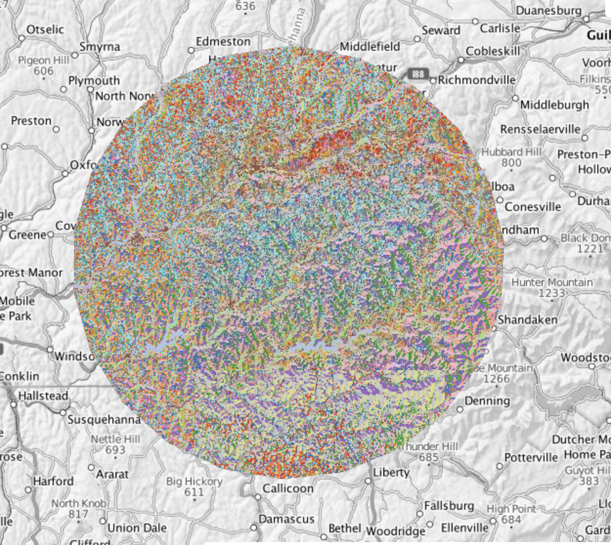

<!-- 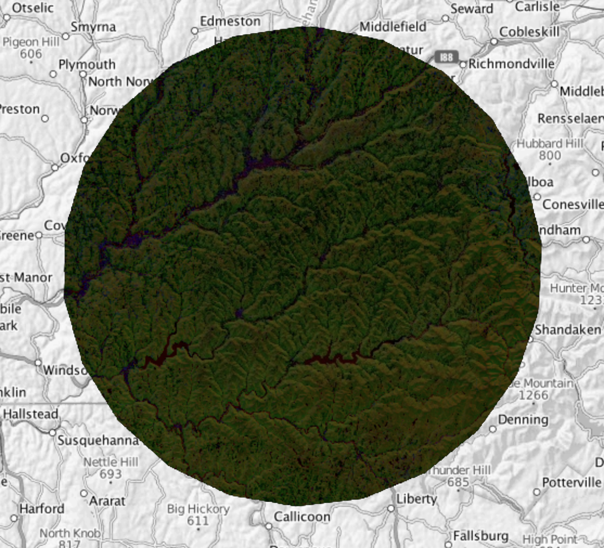 -->

---

### **greenland/** – Glacier Change Detection via Embeddings

Analyzes Greenland glacier regions (Eqip Sermia) using embedding vectors to detect temporal changes.

- Compares embeddings from 2017 and 2024 for glacier regions
- Computes per-pixel Euclidean distances in embedding space
- Visualizes distance heatmaps to identify areas of significant environmental change
- Generates reprojected TIF outputs for further geospatial analysis

**Inputs:** Google Satellite Embeddings (2017, 2024), glacier region coordinates  
**Outputs:** GeoTIFF files with RGB embeddings and Euclidean distance rasters

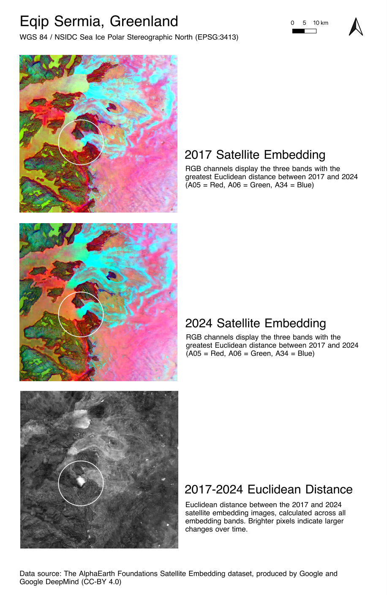

---

### **bay-area/** – Embedding Similarity & Coastal Topology

Explores spatial patterns in the Bay Area's satellite embedding space through k-nearest neighbor networks.

- Samples locations in San Francisco and the Bay Area using both random and grid-based methods
- Constructs k-NN networks in 64D embedding space using cosine similarity
- Compares embedding distances with geographic distances to identify environmental patterns
- Analyzes edge angles in the similarity network to discover that similar conditions cluster at specific orientations (125°), suggesting topographic influence

**Inputs:** Google Satellite Embedding V1 Annual dataset (2024), Bay Area/SF geometry  
**Outputs:** Folium maps with network visualizations, angle distribution histograms

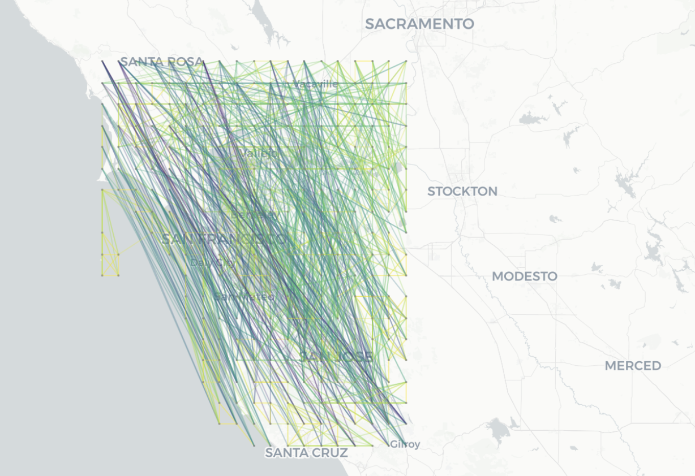
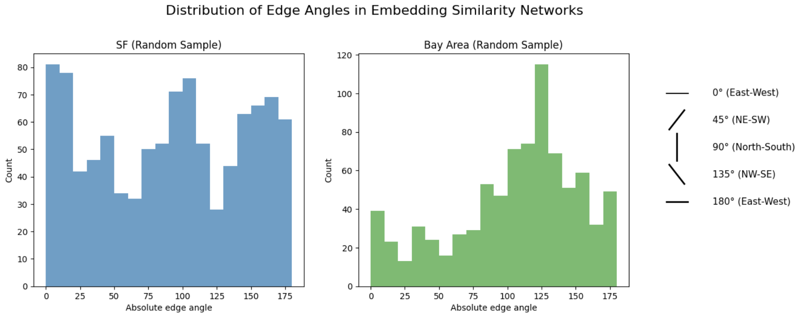

---

### **palestine/** – Regional Embedding Analysis

Analyzes embedding patterns for Palestine region.

**Inputs:** Google Satellite Embeddings, Palestine geometry  
**Outputs:** Interactive maps with embedding visualizations

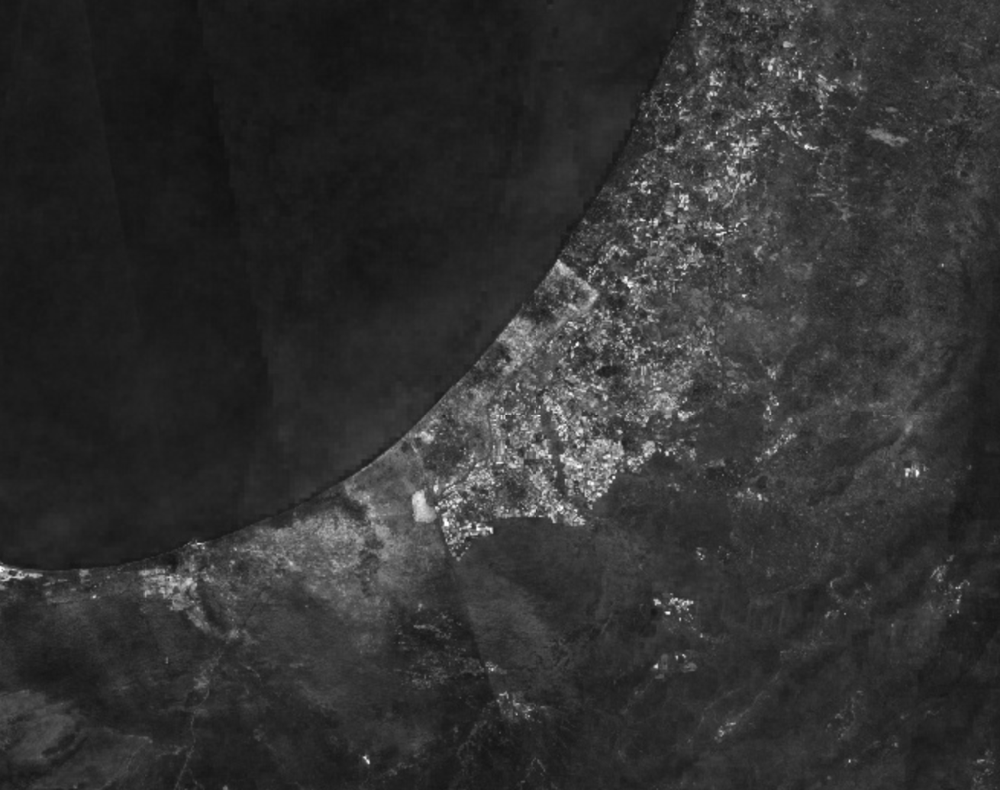

---

### **wisconsin/** – Multi-band Satellite Data Export

Exports all 64 embedding bands as RGB GeoTIFFs for a Wisconsin region.

- Iterates through all 64 embedding bands in groups of 3 (R,G,B)
- Downloads each triple as a separate GeoTIFF at 500m and 5000m resolution
- Stores as individual band-indexed TIFF files

**Inputs:** Google Satellite Embedding V1 (2024), Wisconsin region boundary  
**Outputs:** 21 GeoTIFF files (~500m resolution) + 21 files (~5000m resolution) organized by band groups


---

## Getting Started

### Prerequisites

```bash
pip install -r requirements.txt
```

### Earth Engine Setup

1. Authenticate: `ee.Authenticate()`
2. Initialize with your project: `ee.Initialize(project="your-project")`

### Running Analysis Notebooks

Each directory contains standalone Jupyter notebooks. Run them sequentially.

---

## Data Attribution

Uses Google Earth Engine's AlphaEarth satellite embedding dataset. See individual notebooks for detailed citations.
